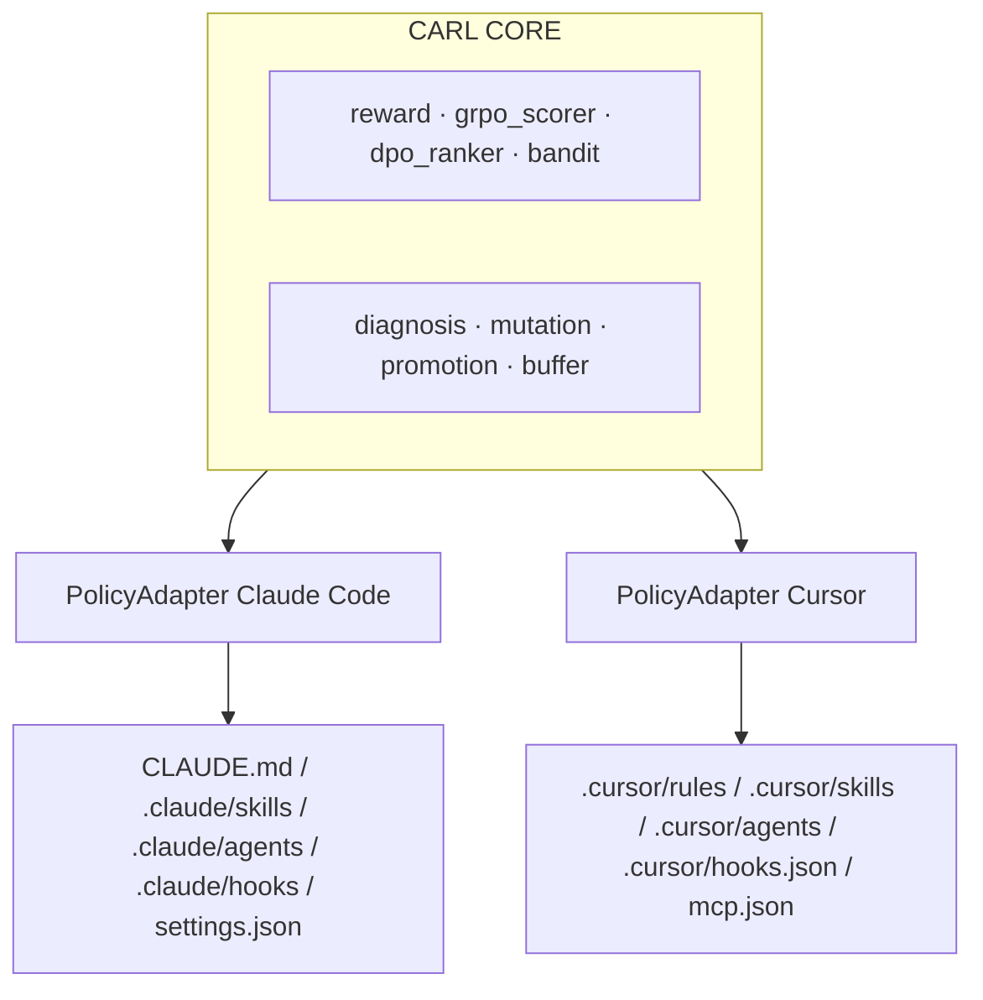

# CARL — Continuous Agent Reinforcement Loop

[](https://github.com/anni-stanford/carl/actions/workflows/ci.yml)
[](https://pypi.org/project/carl-loop/)
[](LICENSE)

> **CARL is the first cross-IDE open-source RL framework that continuously reinforces a coding agent's text-space policy (CLAUDE.md, skills, settings, sub-agent specs, hooks, slash commands) using reward signal extracted from CI/CD outcomes on real repositories. Day-1 support for Claude Code and Cursor; PolicyAdapter pattern for future agents (Codex, Aider, others).**

CARL ≠ fine-tuning model weights. CARL is RL with **text-space policy parameters**. The contribution is the **transposition** of the 2026 post-training RL stack — RLVR, GRPO group-relative scoring, DPO preference optimization, contextual bandits — to the artifacts that condition a coding agent (CLAUDE.md, `.claude/skills`, sub-agents, hooks, MCP config, `.cursor/rules`, `.cursor/skills`). Every promotion is gated by a paired-bootstrap 95 % CI lower bound > 0 on a held-out probe set.

## Author

**Anni Zimina** — Stanford CS153 Spring 2026 final project (research track).

## Quickstart — one supershort command

From inside any git repo with a Python test suite:

```bash
pip install carl-loop
docker build -t carl/episode-claude:latest -f docker/Dockerfile.episode.claude .
export ANTHROPIC_API_KEY=...
carl auto
```

That single `carl auto` runs the entire pipeline end-to-end:

1. **Pre-flight** — checks git, Docker daemon, `ANTHROPIC_API_KEY`.
2. **Auto-discover tasks** from your repo (failing tests, ruff / mypy diagnostics, or the defaults in `carl/tasks/discovery.py`).
3. **Benchmark BEFORE** — runs `n=10` paired tasks under your current `CLAUDE.md` and `.claude/skills/`.
4. **Train** — runs `episodes=20` learning iterations; CARL **actually edits** your `CLAUDE.md` and skills as promoted diffs clear the paired-bootstrap gate.
5. **Benchmark AFTER** — re-runs the same `n=10` tasks under the evolved policy.
6. **Gate** — paired-bootstrap (BCa, 10 000 resamples, n ≥ 30, CI lower bound > 0) on per-task reward deltas.
7. **Report** — writes `CARL_REPORT.md` with the headline table, reward decomposition, the diff history of what CARL changed, per-task breakdown, methodology, and a reproducibility command.

### Try it without Docker / API key

```bash
pip install carl-loop
carl auto --dry-run
```

The `--dry-run` mode uses deterministic synthetic rewards. It exercises the
full pipeline (auto-discovery → benchmark → training with `apply_diff` →
benchmark → gate → report) without any external dependency, so you can
inspect `CARL_REPORT.md` and decide whether to commit to a real run.

### Other commands

```bash
carl init --adapter claude_code   # write a seed policy into the current repo
carl run --task "fix the broken type annotation" --episodes 5
carl status                       # summarise the SQLite replay buffer
carl gate --candidate v1 --baseline stock   # paired-bootstrap A/B on collected rewards
```

## RL formulation

| Concept | CARL meaning |
|---|---|
| **Environment** | A real Git repository with a test suite and CI pipeline. |
| **Episode** | One task assigned to the target coding agent (Claude Code or Cursor) executed inside an isolated sandbox (Docker locally or Cursor cloud VM remotely) against a clone of the repo. |
| **State** _s<sub>t</sub>_ | Repo snapshot + recent PR history + open issues + current policy artifacts + last-_N_ episode rewards. |
| **Action** _a<sub>t</sub>_ | The target agent's full trajectory — tool calls, file edits, sub-agent spawns, retries — terminated by exit or timeout. |
| **Policy** _π_ | The set of editable text artifacts conditioning the agent's behavior. IDE-agnostic representation; the adapter layer translates to disk format per IDE. |
| **Reward** _r<sub>t</sub>_ | _r = w<sub>v</sub>·r<sub>verifier</sub> + w<sub>j</sub>·r<sub>judge</sub> − w<sub>h</sub>·r<sub>hack</sub>_ where _r<sub>verifier</sub>_ comes from CI (RLVR), _r<sub>judge</sub>_ from a position-flipped, family-rotated LLM reviewer, and _r<sub>hack</sub>_ from adversarial reward-hacking probes. |
| **Promotion gate** | A proposed diff is merged into the active policy iff a paired-bootstrap (10 000 resamples) 95 % CI lower bound on its lift over baseline exceeds zero on a held-out probe set. Each promotion is git-tagged with the reward delta. |

## The four-technique stack

1. **RLVR** — CI pipeline as the verifier. Deterministic reward backbone, resistant to hacking by construction.
2. **Group-Relative scoring (GRPO-style at trajectory level)** — _K_ trajectories per task under _K_ policy variants; advantage normalized within group; promote variants with positive advantage **and** CI lower bound > 0.
3. **DPO over policy diffs** — pairwise preference learning trains a lightweight preference model that ranks candidate mutations **before** gate evaluation, cutting gate cost ≈ 3×.
4. **Contextual bandits (Thompson sampling)** — online variant selection with automatic exploration budget.

See [`docs/rl_stack.md`](docs/rl_stack.md) for the full spec.

## Multi-IDE architecture



See [`docs/multi_ide.md`](docs/multi_ide.md) and [`docs/architecture.md`](docs/architecture.md).

## Main results

> Numbers below are placeholders. Experiment scripts (`experiments/run_*.py`) overwrite this section. **No fabricated results.**

| Adapter | Stock baseline | CARL | Mean lift | 95 % CI | _p_-value |
|---|---|---|---|---|---|
| Claude Code | `{{CLAUDE_CODE_BASELINE}}` | `{{CLAUDE_CODE_CARL}}` | `{{LIFT}}` | `{{CI}}` | `{{P}}` |
| Cursor | `{{CURSOR_BASELINE}}` | `{{CURSOR_CARL}}` | `{{LIFT}}` | `{{CI}}` | `{{P}}` |

Cross-IDE transfer (train on Claude Code → eval on Cursor): `{{TRANSFER_RESULT}}`.

## Reproducibility

```bash
git clone https://github.com/anni-stanford/carl
cd carl
pip install -e ".[dev]"
bash scripts/run_all.sh
```

## Limitations (honest)

- **Closed-weight model dependency.** Mutator/judge use Anthropic Claude Opus and OpenAI GPT-5.5 by default. Family rotation includes open-weight models via Cloudflare Workers AI but the headline numbers depend on closed weights.
- **Reward hacking risk.** Mitigated by adversarial probes and an LLM judge with bias controls, **not eliminated**. See [`docs/reward_hacking.md`](docs/reward_hacking.md).
- **Cost of episode execution.** Each episode runs a real CI pipeline. Expensive on large repos.
- **Generalization beyond Python and TypeScript is preliminary.**
- **LLM-judge bias residual.** Position-flip + family-rotation reduce, do not remove, judge bias.

## AI usage disclosure (CS153 AI Policy)

Large-language-model coding assistants were used to help draft initial scaffolding code, documentation, and test fixtures. All design decisions, RL stack implementation, statistical methodology, experimental analysis, paper writing, and final code review are the work of Anni Zimina.

## Citation

```bibtex
@misc{zimina2026carl,
  title  = {CARL: Cross-IDE Reinforcement of Coding Agent Configuration via CI/CD-Signaled Updates over Text-Space Policy Artifacts},
  author = {Zimina, Anni},
  year   = {2026},
  note   = {Stanford CS153 Spring 2026 final project},
  url    = {https://github.com/anni-stanford/carl}
}
```

## License

MIT — see [`LICENSE`](LICENSE).
