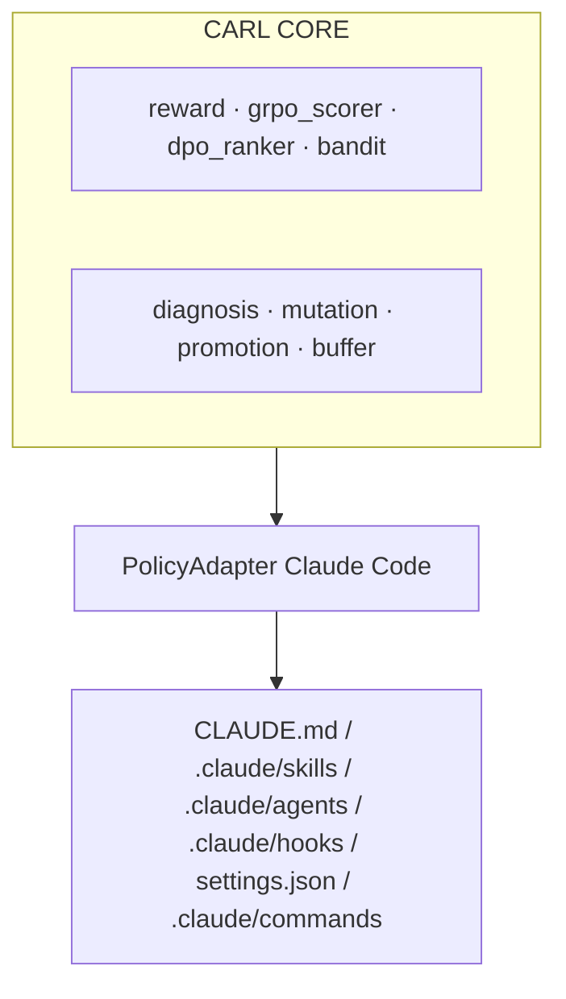

# CARL — Continuous Agent Reinforcement Loop

[](https://github.com/anni-stanford/carl/actions/workflows/ci.yml)
[](https://pypi.org/project/carl-loop/)
[](LICENSE)

> **CARL is an open-source RL framework that continuously reinforces Claude Code's text-space policy — `CLAUDE.md`, `.claude/skills/`, sub-agent specs, hooks, slash commands, and `settings.json` — using reward signal extracted from CI/CD outcomes on real repositories.**

CARL ≠ fine-tuning model weights. CARL is RL with **text-space policy parameters**. The contribution is the **transposition** of the 2026 post-training RL stack — RLVR, GRPO group-relative scoring, DPO preference optimization, contextual bandits — to the artifacts that condition Claude Code. Every promotion is gated by a paired-bootstrap 95 % CI lower bound > 0 on a held-out probe set.

## Author

**Anni Zimina** — Stanford CS153 Spring 2026 final project (research track).

## Quickstart — one pasteable command

From inside any git repo with a Python test suite, paste this one line:

```bash
curl -sSL https://raw.githubusercontent.com/anni-stanford/carl/main/scripts/quickstart.sh | bash
```

That single line installs `carl-loop` from GitHub, detects whether you have `ANTHROPIC_API_KEY` set and Docker running, builds the episode image (one-time, ~3 min) if needed, and runs `carl auto` end-to-end against the current directory. If either prerequisite is missing it falls back to `carl auto --dry-run` so you still see a real `CARL_REPORT.md` (synthetic rewards, real statistical pipeline) without any external dependency.

If you prefer the explicit steps:

```bash
pip install git+https://github.com/anni-stanford/carl.git    # one-time
python -m carl auto --dry-run                                # no Docker, no API key
# or, for a real run:
docker build -t carl/episode-claude:latest -f docker/Dockerfile.episode.claude .
export ANTHROPIC_API_KEY=...
python -m carl auto
```

## RL formulation

| Concept | CARL meaning |
|---|---|
| **Environment** | A real Git repository with a test suite and CI pipeline. |
| **Episode** | One task assigned to Claude Code, executed inside an isolated Docker sandbox against a clone of the repo. |
| **State** _s<sub>t</sub>_ | Repo snapshot + recent PR history + open issues + current policy artifacts + last-_N_ episode rewards. |
| **Action** _a<sub>t</sub>_ | Claude Code's full trajectory — tool calls, file edits, sub-agent spawns, retries — terminated by exit or timeout. |
| **Policy** _π_ | The set of editable text artifacts conditioning Claude Code's behavior: `CLAUDE.md`, `.claude/skills/`, `.claude/agents/`, `.claude/hooks/`, `.claude/settings.json`, `.claude/commands/`. |
| **Reward** _r<sub>t</sub>_ | _r = w<sub>v</sub>·r<sub>verifier</sub> + w<sub>j</sub>·r<sub>judge</sub> − w<sub>h</sub>·r<sub>hack</sub>_ where _r<sub>verifier</sub>_ comes from CI (RLVR), _r<sub>judge</sub>_ from a position-flipped, family-rotated LLM reviewer, and _r<sub>hack</sub>_ from adversarial reward-hacking probes. |
| **Promotion gate** | A proposed diff is merged into the active policy iff a paired-bootstrap (10 000 resamples) 95 % CI lower bound on its lift over baseline exceeds zero on a held-out probe set. Each promotion is git-tagged with the reward delta. |

## The four-technique stack

1. **RLVR** — CI pipeline as the verifier. Deterministic reward backbone, resistant to hacking by construction.
2. **Group-Relative scoring (GRPO-style at trajectory level)** — _K_ trajectories per task under _K_ policy variants; advantage normalized within group; promote variants with positive advantage **and** CI lower bound > 0.
3. **DPO over policy diffs** — pairwise preference learning trains a lightweight preference model that ranks candidate mutations **before** gate evaluation, cutting gate cost ≈ 3×.
4. **Contextual bandits (Thompson sampling)** — online variant selection with automatic exploration budget.

See [`docs/rl_stack.md`](docs/rl_stack.md) for the full spec.

## Architecture



The `PolicyAdapter` ABC is preserved so future agents (Codex, Aider, …) can plug into the same RL machinery without changing the loop. The Claude Code adapter is the only adapter shipped today. See [`docs/architecture.md`](docs/architecture.md).

## Main results

> Numbers below are placeholders. Experiment scripts (`experiments/run_*.py`) overwrite this section after a real run. **No fabricated results.**

| Stock baseline | CARL | Mean lift | 95 % CI | _p_-value |
|---|---|---|---|---|
| `{{CLAUDE_CODE_BASELINE}}` | `{{CLAUDE_CODE_CARL}}` | `{{LIFT}}` | `{{CI}}` | `{{P}}` |

## Reproducibility

```bash
git clone https://github.com/anni-stanford/carl
cd carl
pip install -e ".[dev]"
bash scripts/run_all.sh
```

## Limitations (honest)

- **Closed-weight model dependency.** Mutator/judge use Anthropic Claude Opus and OpenAI GPT-5.5 by default. Family rotation includes open-weight models via Cloudflare Workers AI but the headline numbers depend on closed weights.
- **Reward hacking risk.** Mitigated by adversarial probes and an LLM judge with bias controls, **not eliminated**. See [`docs/reward_hacking.md`](docs/reward_hacking.md).
- **Cost of episode execution.** Each episode runs a real CI pipeline. Expensive on large repos.
- **Generalization beyond Python is preliminary.**
- **LLM-judge bias residual.** Position-flip + family-rotation reduce, do not remove, judge bias.

## AI usage disclosure (CS153 AI Policy)

Large-language-model coding assistants were used to help draft initial scaffolding code, documentation, and test fixtures. All design decisions, RL stack implementation, statistical methodology, experimental analysis, paper writing, and final code review are the work of Anni Zimina.

## Citation

```bibtex
@misc{zimina2026carl,
  title  = {CARL: Continuous Agent Reinforcement Loop for Claude Code Configuration via CI/CD-Signaled Updates over Text-Space Policy Artifacts},
  author = {Zimina, Anni},
  year   = {2026},
  note   = {Stanford CS153 Spring 2026 final project},
  url    = {https://github.com/anni-stanford/carl}
}
```

## License

MIT — see [`LICENSE`](LICENSE).
