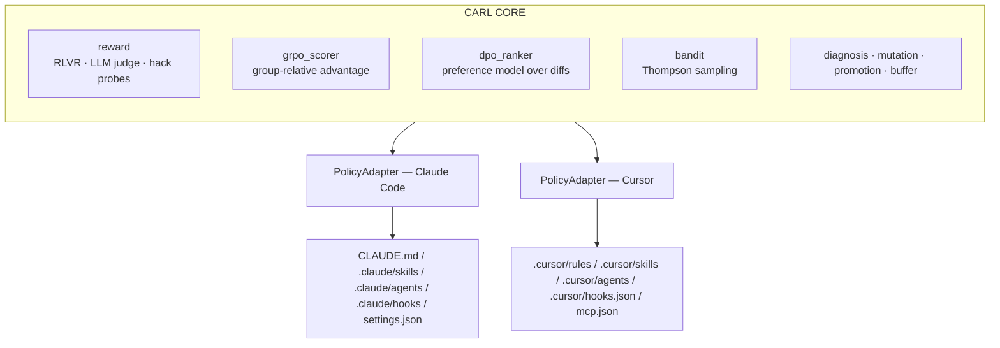

# CARL — Architecture

CARL splits cleanly into an **IDE-agnostic core** and **IDE-specific adapters**.



## Artifact mapping

| Semantic role | Claude Code path | Cursor path |
|---|---|---|
| Project rules / context | `CLAUDE.md` | `.cursor/rules` |
| Skills | `.claude/skills/*/SKILL.md` | `.cursor/skills/*/SKILL.md` |
| Sub-agents | `.claude/agents/*.md` | `.cursor/agents/*.md` |
| Hooks | `.claude/hooks/*.sh` | `.cursor/hooks.json` |
| MCP config | `.claude/settings.json` | `.cursor/mcp.json` |
| Slash commands | `.claude/commands/*.md` | (n/a) |

## Data classes

- `Artifact(name, type, content, metadata)` — single editable text artifact.
- `Policy(artifacts, version, parent_version, …)` — versioned snapshot with `policy_hash`.
- `PolicyDiff(operation, line_range, old_content, new_content, …)` — proposed mutation, ≤ `max_diff_lines`.
- `Task(task_id, repo_path, prompt, adapter_name, …)` — unit of work.
- `Trajectory(task, policy, events, files_changed, exit_code, …)` — full episode record.

## PolicyAdapter contract

```python
class PolicyAdapter(ABC):
    async def read_policy(self, repo_path: Path) -> Policy: ...
    async def write_policy(self, repo_path: Path, policy: Policy) -> None: ...
    async def run_episode(self, repo_path: Path, task: Task,
                          policy: Policy, timeout_s: int) -> Trajectory: ...
    def list_artifact_types(self) -> list[ArtifactType]: ...
    def name(self) -> str: ...
```

Both adapters round-trip `read_policy(write_policy(P)) == P` (`policy_hash` parity, see `tests/unit/test_*_round_trip.py`).
